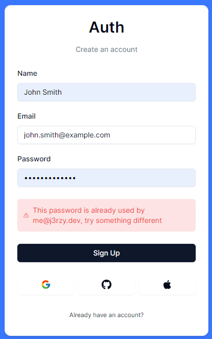

# Fucking spaghetti code
</img>
## Features:
- At least one unintended exploit
- Unmaintainable spaghetti code
- Top-notch security features (example above)
- RegExp based search
- \<2 years load times
- Unintuitive UI
- Barely working login system
- Chance to get copyright struck by OLX
## How to run:
1. Clone the repository
2. `cd` into cloned repository
3. Install necessary dependencies: `npm i`
4. Rename `.env.template` to `.env` and fill it with necessary info
5. Remove files with errors (if any)
6. Run project: `npm run start`
## How to prepare database:
1. `cd` into cloned repository
2. run command `npm run generate`
3. a) run command `npm run pushtodb` (recommended)<br>b) execute script `sql/SCRIPT.sql` on user with sufficient permissions
## Development notes:
**How to run raw SQL in Prisma:**
```ts
db.$queryRaw<Type>`QUERY`;
```
**How to add field to user to retrieve it using `useSession()`:**<br>
`@/session.ts`:
```ts
async session ( { token, session }: { token: JWT, session: { user: AdapterUser } & AdapterSession & Session } )
{
  ...
  
  if ( token.customField && session.user )
    session.user.customField = token.customField;
  
  ...
},
async jwt ( { token }: { token: JWT } ): Promise<JWT>
{
  ...
  
  token.customField = existingUser.customField;
  
  ...
},
```
`@/next-session.d.ts`:
```ts
export type ExtendedUser = DefaultSession["user"] & {
  ...
  
  customField: Type;
  
  ...
}

...

declare module "@session/core/jwt"
{
  interface JWT
  {
    ...
    
    customField: Type;
    
    ...
  }
}
```
**What's the meaning of life**:
```
There is none
```