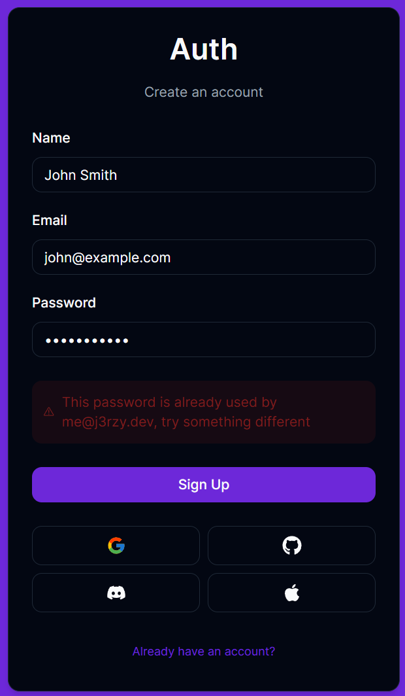

# Fucking spaghetti code
</img>
## How to run:
1. Clone the repository
2. Install necessary dependencies: `npm i`
3. Rename `.env.template` to `.env` and fill it with necessary info
4. Remove files with errors (if any)
5. Run project: `npm run start`
### Development notes:
How to run raw SQL in Prisma:<br>
```ts
db.$queryRaw<Type>`QUERY`;
```
What's the meaning of life:
```
There is none
```